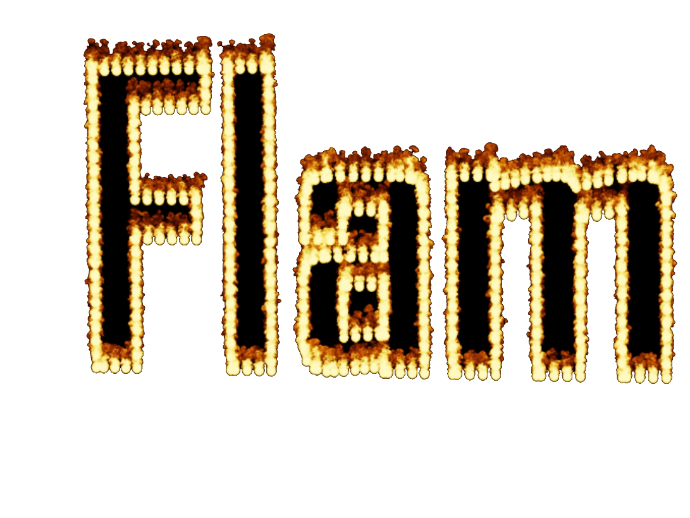
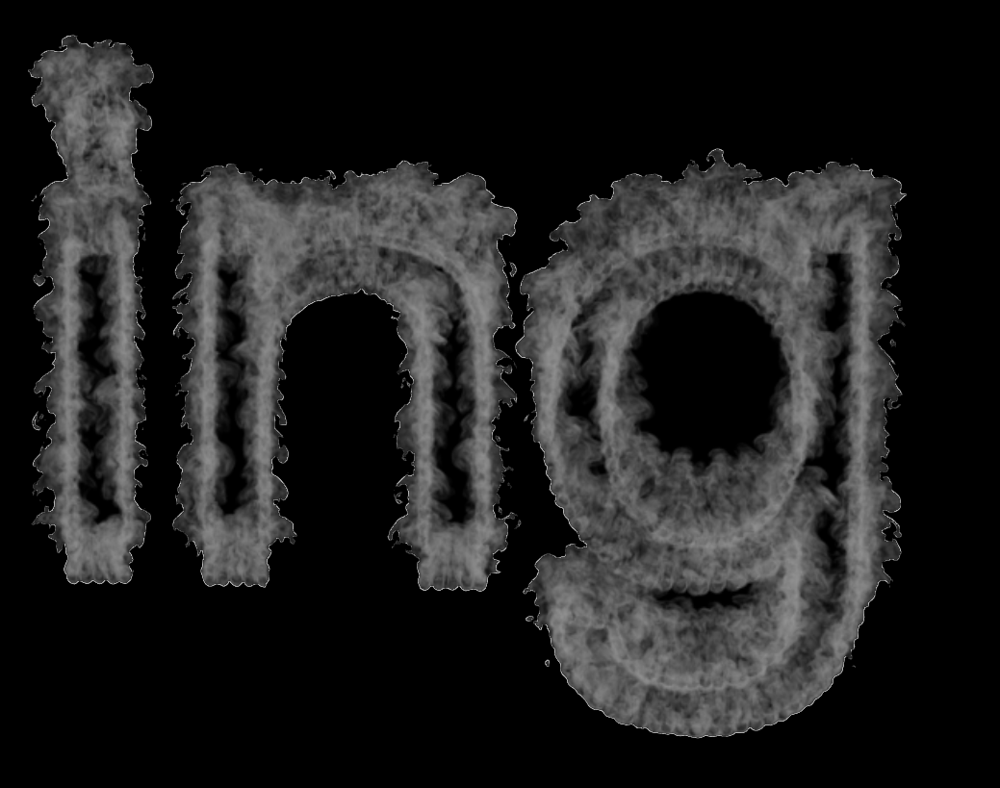
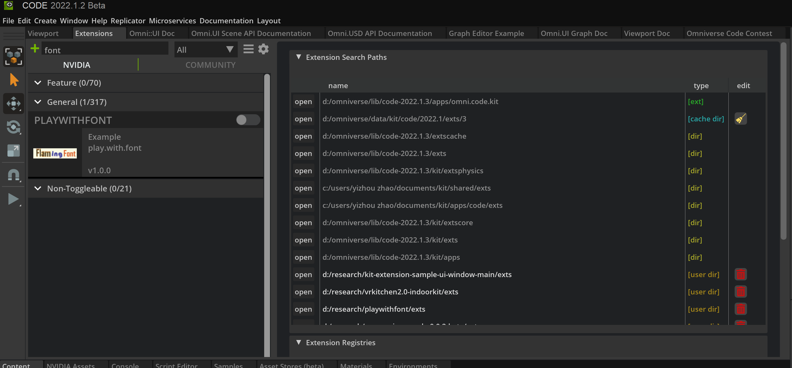
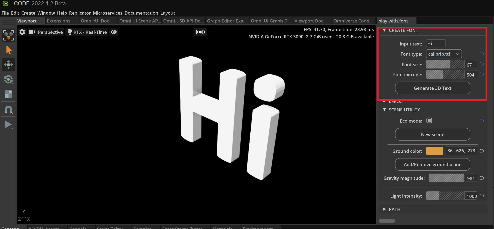
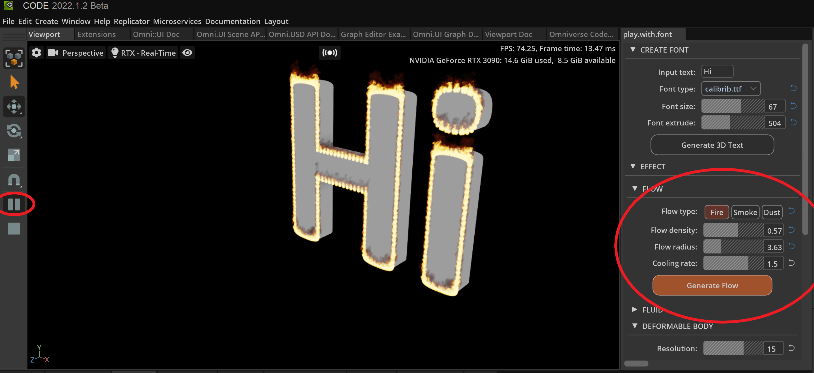
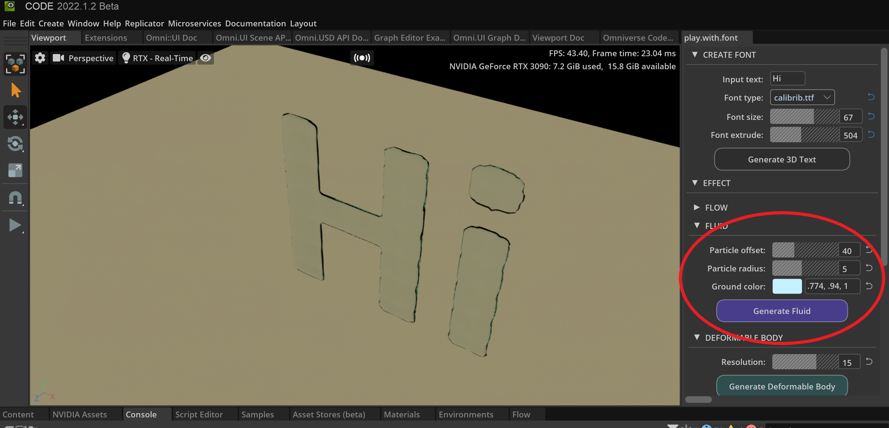
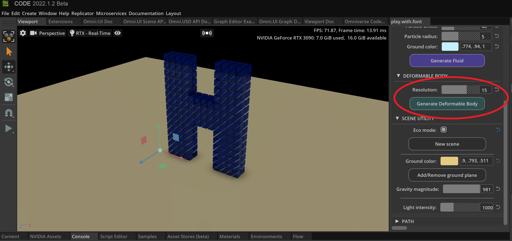
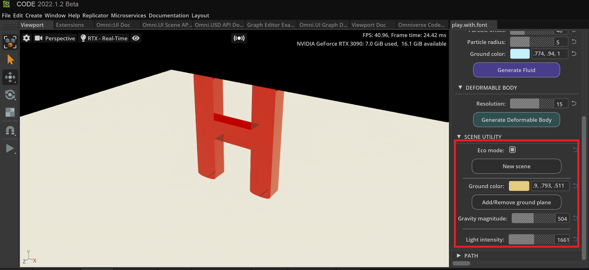

# Play With Font

> **Warning**
> It takes about one minute to first load this extension because of the pip installation for dependencies.


This extension allows to create 3D Font with amazing effects. 

This repository is inspired by [codetigerFont23D](https://github.com/codetiger/Font23D) and [freefont-py](https://github.com/rougier/freetype-py).


<div>
    
    
    
    
</div>


3D fonts provide a visual depth. Together with Omniverse, 3D fonts can shine with wonderful effect. Use our 3D font generator to make your own designs, with flow (fire, frog, dust), fluid, rigid body and deformable body. [Introduction video here](https://drive.google.com/file/d/1a1UgZ7u4xnhO4gO6bWf95Gn8Do6B8YjK/view?usp=sharing)


# Get started with Omniverse Code/Create [version >= 2022]

## Download the [release](https://github.com/yizhouzhao/PlayWithFont/releases/tag/0.2) or clone the this repository 

```
git clone https://github.com/yizhouzhao/PlayWithFont
```

Upzip or locate the root folder as <your-path-to-PlayWithFont>

The file structure of this extension should look like:

```
<your-path-to-PlayWithFont>
    └───exts    [Omniverse extenstion]
         └───play.with.font
                └───fonts   [.tff font asset]
                └───config  [Extension config]
                └───model    [Path to save 3D Font model ]
                └───icons   [Extension icons]
                └───plat/with/font   [source code]
    └───img   
    │   .gitignore 
    │   README.md  
    ......
```

## Add extension to Omniverse

1. **[Open extension manager]** After opening Omniverse Code, go to `Menu` -> `Window` -> `Extension`

2. **[Add this extension to Omniverse]** Click the   button, add absolute extension path to `Extension Search Paths`.

Finally, you can search the `play.with.font` and enable this extension.

> **Note**:
> The extension path to add is: `<your-path-to-PlayWithFont>/exts`

## Install requirements

There are three packages will be automatically installed while loading the `play.with.font` extension

- [freefont-py](https://pypi.org/project/freetype-py/) (to previde python bindings for the FreeType library)
- [shapely](https://pypi.org/project/Shapely/) (for manipulation and analysis of planar geometric objects)
- [triangle](https://pypi.org/project/triangle/) (to triangulate meshes)




# Play with Indoorkit

The functionality of our `play.with.font`  has three parts:

- CREATE FONT: create 3D font

- EFFECT: add effect to the font.

- SCENE UTILITY: set up scene features.

## 1. Create font



Type your input text, adjust features and click `Create 3D Text` to create the 3D model.

## 2. Effect

### 2.1 Flow 

**Select** the 3D text in the scene; 

Choose flow type (fire, smoke, dust), set up flow properties, and click `Create Flow`

> **Note**:
> It takes a while (about 10s) to generate this flow effect because of the many particles.

Click `Play` to show the effect



### 2.2 Fluid

**Select** the 3D text in the scene

Set up fluid properties, and click `Create Fluid`

Click `Play` to show the effect



### 2.3 Deformable Body

**Select** the 3D text in the scene

Set up fluid properties, and click `Create Deformable Body`

Click `Play` to show the effect

> **Note**:
> Create One char only and use this effect. (For example, only give deformable body to one letter H)



## 3. Scene utility

Set up scene utilities including ground plane, light, gravity.


